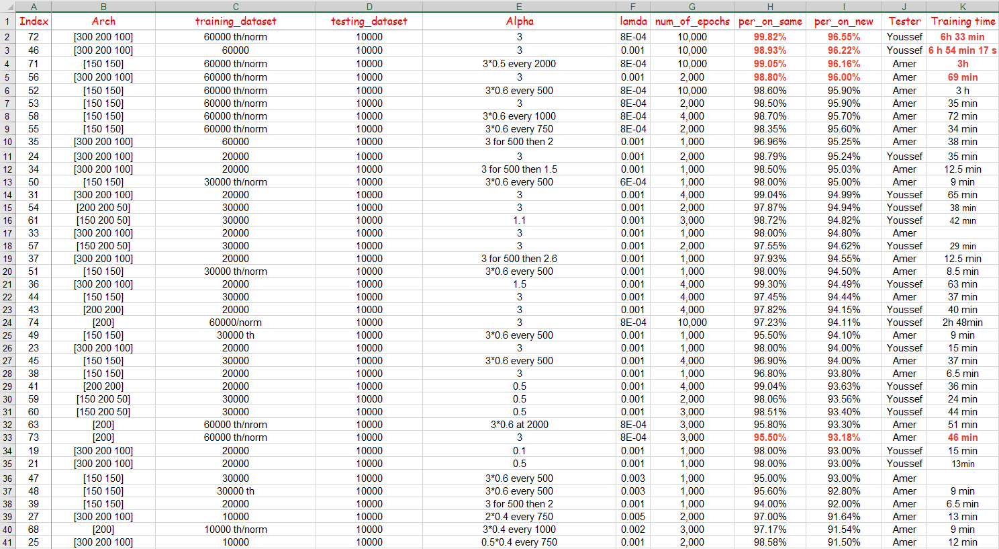

# Handwritten-Digit-Classifier-Neural-Network-with-Matlab

## About the project
This is a simple Neural Network built from skracth using Matlab for MINST dataset classification problem.
The training is done by (full) patch gradient descent algorithm.

The program includes simple pre-training processing functions like thresholding and normalization.
The network architecture can be defined with any numver of layers as needed.

We managed to get up to 96.55% accuracy on testing data with [300 200 100] and [150 150] architectures.

## How to use
You need to first download the training and testing data from the link: https://www.kaggle.com/oddrationale/mnist-in-csv
The two files should be in the main project file.

In the main.m file you can find settings you can adjust.
You can have up to 60.000 training data.
You can have dynamic learning rate by multipling the original learning rate by a constant every number of epochs.

The code shows and saves many files after finishing all the epochs including:
 - Graph and matrix of cost over the epochs.
 - Final weights matrix
 - Text file with training parameters.
 - Graphs of confusion on all classes on both training data and testing data after fininshing the training.
 - Confusion over the whole training process

## Top 40 Test Results

# Original Report
## ABSTRACT:

In this project, we design an artificial neural network model that can recognize hand-written digits and
accurately give a prediction about its label.

Using MATLAB, we implemented our design of the network and started training and testing to try and
improve the results and our main method was by trial and error.

Throughout the whole process we obtained a lot of results that ranged between 11% accuracy for our
worst case and 96% accuracy on the best case.

In this project the main benefit was what we gain in terms of knowledge about how to make a neural
network and optimizing it in order to try and get the best possible results out of the neural network.

## INTRODUCTION:

The main goal of this project is to design a neural network that can detect handwritten digits.

We choose the MNIST dataset as it has more than enough labelled images and was already split into
train (60000 image) and test (10000 image). MNIST is probably the most famous and reliable dataset for
the handwritten digits' classification problem.

In their official website the data was compressed in “.gz” file which could post some problems trying to
read such an extension in the MATLAB, so we search for an alternative for the same dataset but in “csv”
format on the following website: “https://www.kaggle.com/oddrationale/mnist-in-csv”.

After importing it to MATLAB we had to split both training and testing data into image vectors and labels
so that we can start training the data using a classification network with an input layer of 784
perceptron (28 x 28) and output layer of 10 perceptron each representing one of the digits 0 to 9.

## METHOD:

For the single layer perceptron, we tried different architectures for a hidden layer such as: 50, 100, 200,
300 and we mostly had more success with the 200

For the multilayer perceptron, we also tried different architectures for a hidden layers such as: [300 200
100], [150 150], [150 200 50], [100 100 100 100], [600 500 400 300 200 100] and we mostly had more
success with both the [300 200 100] and [150 150].

As it was stated above, we relied on the trial-and-error method for both the parameters and the number
of hidden layers (architecture) throughout the training process and we documented every test with its
outputs and parameters on an excel file that is going to be attached with the project.

